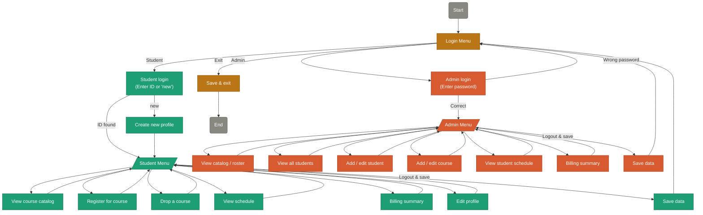

# unknownapp
This is an unknown application written in Java

---- For Submission (you must fill in the information below) ----
### Use Case Diagram

### Flowchart of the main workflow

```mermaid
flowchart TD
    START(Start) --> LOGIN

    LOGIN[Login Menu]

    LOGIN -->|Student| SLOGIN
    LOGIN -->|Admin| ALOGIN
    LOGIN -->|Exit| SAVE_EXIT

    %% ── Student path ──────────────────────────────
    SLOGIN["Student login\n(Enter ID or 'new')"]
    SLOGIN -->|new| CREATE["Create new profile"]
    SLOGIN -->|ID found| SMENU

    CREATE --> SMENU

    SMENU[/"Student Menu"/]
    SMENU --> S1["View course catalog"]
    SMENU --> S2["Register for course"]
    SMENU --> S3["Drop a course"]
    SMENU --> S4["View schedule"]
    SMENU --> S5["Billing summary"]
    SMENU --> S6["Edit profile"]
    SMENU -->|Logout & save| SAVE_S["Save data"]

    S1 & S2 & S3 & S4 & S5 & S6 --> SMENU
    SAVE_S --> LOGIN

    %% ── Admin path ─────────────────────────────────
    ALOGIN["Admin login\n(Enter password)"]
    ALOGIN -->|Wrong password| LOGIN
    ALOGIN -->|Correct| AMENU

    AMENU[/"Admin Menu"/]
    AMENU --> A1["View catalog / roster"]
    AMENU --> A2["View all students"]
    AMENU --> A3["Add / edit student"]
    AMENU --> A4["Add / edit course"]
    AMENU --> A5["View student schedule"]
    AMENU --> A6["Billing summary"]
    AMENU -->|Logout & save| SAVE_A["Save data"]

    A1 & A2 & A3 & A4 & A5 & A6 --> AMENU
    SAVE_A --> LOGIN

    %% ── Exit ────────────────────────────────────────
    SAVE_EXIT["Save & exit"]
    SAVE_EXIT --> END(End)

    %% ── Styles ──────────────────────────────────────
    classDef teal  fill:#1D9E75,stroke:#0F6E56,color:#fff
    classDef coral fill:#D85A30,stroke:#993C1D,color:#fff
    classDef amber fill:#BA7517,stroke:#854F0B,color:#fff
    classDef gray  fill:#888780,stroke:#5F5E5A,color:#fff
    classDef purple fill:#7F77DD,stroke:#534AB7,color:#fff

    class SLOGIN,CREATE,SMENU,S1,S2,S3,S4,S5,S6,SAVE_S teal
    class ALOGIN,AMENU,A1,A2,A3,A4,A5,A6,SAVE_A coral
    class LOGIN,SAVE_EXIT amber
    class START,END gray
```

### Prompts
