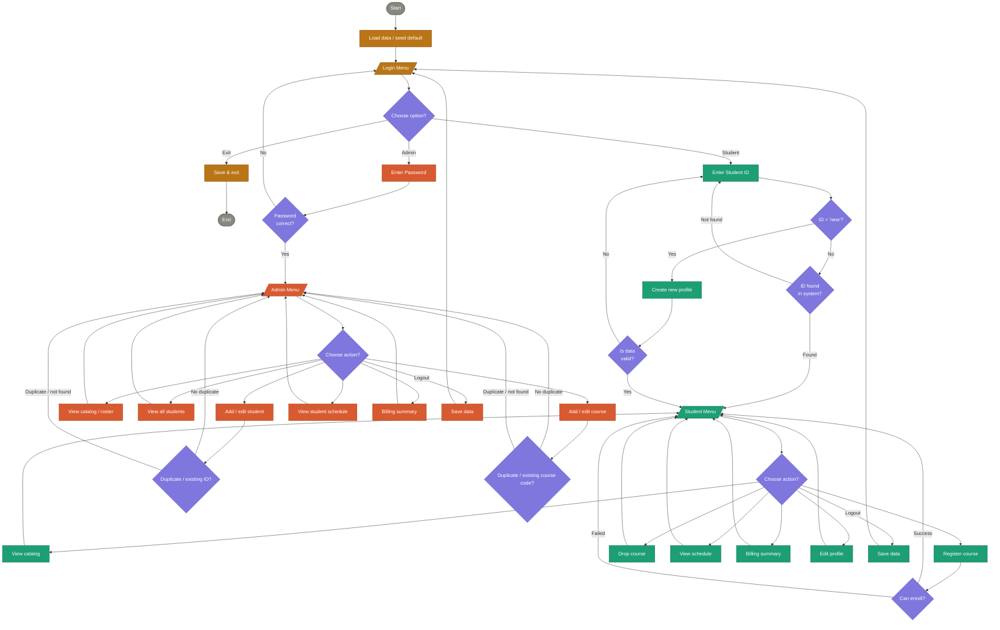

# unknownapp
This is an unknown application written in Java

---- For Submission (you must fill in the information below) ----
### Use Case Diagram

### Flowchart of the main workflow

### Prompts

create an equivalent Python version of the program for the loginMenu, studentLogin, and createStudentProfile, adminLogin studentMenu, adminMenu sections. Put the Python program in a new folder called “python.” 
